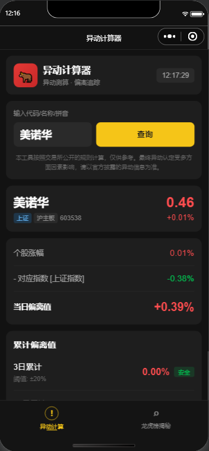
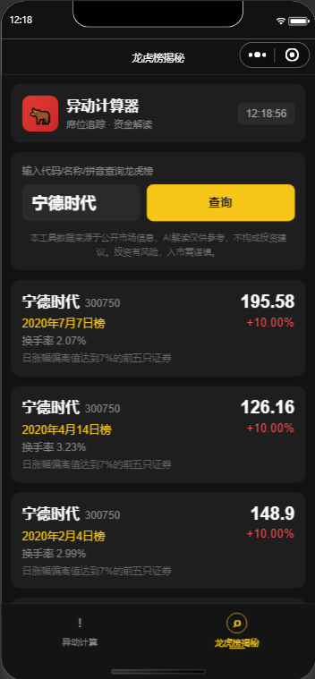

# stockMonitorMini

#### 介绍
【异动计算器助手】微信小程序，一款简易的股票异动计算器工具（微信搜索同名小程序，可直接体验效果）。
盘中实时查看异动状态，便捷的数据偏离度计算和龙虎榜数据监测工具。
主要用于判断是否触发交易所规定的异常波动或严重异常波动标准。
支持实时数据查询与对比分析，可视化显示偏离状态；支持查询当日或者历史龙虎榜数据，监测大资金动向。精准对标交易所规则.

#### 核心功能：
输入股票代码，自动匹配对应基准指数（沪→上证、深主板→深 A 指 399107、创业板→创业板指、科创板→科创 50），一键算出单日偏离、3 日累计偏离、10 日 / 30 日严重异动偏离，自动判定是否触发异动（主板 3 日 ±20%、双创 3 日 ±30%）。

#### 优势：
按交易所新规「区间整体涨跌幅差值」计算（非逐日累加），贴合龙虎榜公告口径，功能完全免费。
免去人工手工计算的麻烦，也不需要懂具体的严重异动涨跌幅计算规则。

#### 体验方式

1.  微信搜索🔍 **【异动计算器助手】** 微信小程序或者微信扫一扫如下小程序二维码
2.  进入小程序，输入股票代码、拼音检查或者股票全称
3.  查询，即可查询实时的股票异动偏离值结果，可以大概预估股票再涨跌多少，将触发交易所规定的涨跌幅异动上下限。
#### 

#### 软件截图
【异动查询】
####

#### 
【龙虎榜查询】
####

#### 反馈和建议
任何反馈和建议，请留言。

